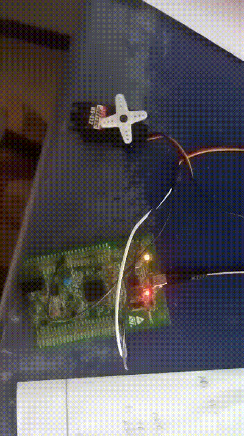

  

# STM32F4-Servo-Motor-Controller
 A minimalistic project for controlling servo motors using STM32F401 microcontroller.

# Requirements
 - Servo Motor MG995
 - STM32  Microcontroller Board.
 - STM32CubeMX Tool. 
 - STM32CubeIDE Development Environment.
 - USB-Mini USB adapter.

# Demo 

# References
This package is based on the following references:

STMicroelectronics. (n.d.). STM32CubeMX User Manual.  https://www.st.com/resource/en/user_manual/dm00104712-stm32cubemx-for-stm32-configuration-and-initialization-c-code-generation-stmicroelectronics.pdf

STMicroelectronics. (n.d.). STM32CubeIDE User Manual. https://www.st.com/resource/en/user_manual/dm00607345-stm32cubeide-getting-started-stmicroelectronics.pdf

# License
This package is released under the GNU General Public License v3. See the LICENSE file for more information.
